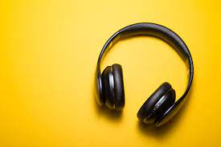

# What is Computer?

**What is Computer** : Computer is an electronic device that is designed to work with [Information](https://ecomputernotes.com/fundamental/information-technology/what-do-you-mean-by-data-and-information). *The term computer *is *derived from the Latin term* **‘** **computare** **’, this means to** *calculate* **or**  *programmable machine* **.**  **Computer can not do anything without a Program** . It represents the decimal numbers through a string of [binary digits](https://ecomputernotes.com/fundamental/number-system/bit). The Word ‘Computer’ usually refers to the [Center Processor Unit](https://ecomputernotes.com/fundamental/introduction-to-computer/what-is-cpu) plus Internal [memory](https://ecomputernotes.com/fundamental/input-output-and-memory/memory "memory").What is Computer?

# **Input Devices:**

1. Keyboard

   
2. Mouse (including touchpad and pointing stick)

   
3. Joystick

   
4. Graphic Tablet

   
5. Scanner

    
6. Webcam

    
7. Microphone

   
8. MIDI Keyboard

   
9. Barcode Reader

   
10. Touchscreen

    

# **Output Devices**

1. Monitor (or display)

   
2. Printer

   
3. Speaker

   
4. Headphones

    
5. Projector

    
6. Plotter

    
7. Braille Display

    
8. LED/LCD Panel (found in some appliances and gadgets)

    
9. Haptic Feedback Devices (provide tactile feedback)

    
10. 3D Printer (can be considered both input and output)
    
    

### Generally following Computer hardware components are required

•  **[Memory](https://ecomputernotes.com/fundamental/input-output-and-memory/memory "memory")** : It is a physical device (integrated circuits or chip) that enables a computer to store data and programs temporarily or permanently. It is also term as “primary storage”.
• **[CPU](https://ecomputernotes.com/fundamental/introduction-to-computer/what-is-cpu)** ( **[Central Processing Unit](https://ecomputernotes.com/fundamental/introduction-to-computer/what-is-cpu)** ): It is also referred to as a processor or brains of a computer that carries out the instructions of a computer system.

# Uses of Computer

**Education :** Getting the right kind of [information](https://ecomputernotes.com/fundamental/information-technology/what-do-you-mean-by-data-and-information) is a major challenge as is getting [information](https://ecomputernotes.com/fundamental/information-technology/what-do-you-mean-by-data-and-information) to make sense.

* Health and Medicine
* Science
* Business
* Recreation and Entertainment
* Government
* Defence
* Sports
* Recording Information
* Analyzing Movements
* Writers
* Scoreboard
* Safety

* [1. Analogue Computer](https://ecomputernotes.com/fundamental/introduction-to-computer/types-of-computers#1_Analogue_Computer "1. Analogue Computer")
* [2. Digital Computer](https://ecomputernotes.com/fundamental/introduction-to-computer/types-of-computers#2_Digital_Computer "2. Digital Computer")
* [3. Hybrid Computer](https://ecomputernotes.com/fundamental/introduction-to-computer/types-of-computers#3_Hybrid_Computer "3. Hybrid Computer")

# Different kinds and sizes of computer

## Supercomputer

A [supercomputer](https://ecomputernotes.com/fundamental/introduction-to-computer/supercomputer) is the fastest computer on earth that could process a considerable number of information very quickly.

These computers will be massive regarding the size. A most potent supercomputer could occupy several feet to hundreds of feet. The supercomputer cost is exceptionally high, and they can range from two lakh buck to over 100 million dollars.

### Uses of Supercomputers

* Weather Forecasting
* Scientific Research
* Data Mining

### The Top Five Popular Supercomputers

• JAGUAR, Oak Ridge National Laboratory

• NEBULAE, China

## Mainframe computer

The [mainframe](https://ecomputernotes.com/fundamental/introduction-to-computer/mainframe) denotes the sort of computer which runs a whole corporation. The Mainframe computers can accommodate in large air-conditioned rooms because of its dimensions in the current world, where all of the companies, trades, and communications are real-time.

### Popular Mainframe computers

• IBM 1400 series.

• 700/7000 series.

• System/360.

## Minicomputer

A [minicomputer](https://ecomputernotes.com/fundamental/introduction-to-computer/minicomputer) also referred to as miniature. It’s a category of little computers which has introduced to the world from the mid-1960s. Minicomputers used by small businesses. A minicomputer is a computer that has all of the qualities of a considerable size pc, but its size is significantly smaller compared to those. A minicomputer can also be known as a mid-range pc. Minicomputers are primarily multi-users systems where more than one user can operate concurrently.

#### Different Types of Minicomputers

• Tablet PCs

• Smartphones

• Notebooks

• Touch Screen Pads

• High-End Music Plays

• Desktop Mini Computers

## Microcomputer

Micro Computer is a little computer. Your private machines are equal to the microcomputer. Mainframe and Mini Computer is the ancestor of all microcomputers. Integrated Circuit manufacturing technology reduces the size of Mainframe and Minicomputer.

### Types of Micro Computer

• Desktop computers

• laptops

• personal digital assistant (PDA)

• tablets

• telephones

## What is Software | Type of Software | Definition of Software

 **What is Software** :  *[Computer](https://ecomputernotes.com/fundamental/introduction-to-computer/what-is-computer) software* , or only software, is a kind of program that enable a user to perform some specific task or used to operate a [computer](https://ecomputernotes.com/fundamental/introduction-to-computer/what-is-computer). It directs all the peripheral devices on the computer system – what to do and how to perform a task. PC Software plays the role of mediator between the user and computer hardware. Without software, a user can’t perform any task on a [digital computer](https://ecomputernotes.com/fundamental/introduction-to-computer/explain-about-the-evolution-of-digital-computers).

## **Type of Software**

The software has mainly divided into two categories: Application software and System software.

**Application Software**

*Applications software* also called **end-user programs** or merely an application. It resides above system software. The end-user uses applications software for a specific purpose.

### System Software

*System Software* (the type of  **computer program** ) provides a platform to run a computer’s hardware and computer application to utilize system resources and solve their computation problem.

# Advantages And Disadvantages Of Computer

## Advantages of computer

* Multitasking
* Speed
* Cost/ Stores huge amount of data
* Accuracy
* Data Security
* Disadvantage of Computer
* Virus and hacking attacks
* Online Cyber Crimes
* Reduction in employment opportunity

# Block Diagram of Computer and Explain its Various Components

A [computer](https://ecomputernotes.com/fundamental/introduction-to-computer/what-is-computer) can process data, pictures, sound and graphics.

# Functional Units

* Arithmetic Logical Unit (ALU)
* Control Unit (CU)
* Central Processing Unit (CPU)

# History of Computer | Generation of Computer

- **First Generation (1946-1954)**

**Limitations of First Generation Computer**

Followings are the major drawbacks of First generation computers.

1. They used valves or vacuum tubes as their main electronic component.
2. They were large in size, slow in processing and had less storage capacity.
3. They consumed lots of electricity and produced lots of heat.

Example: ENIAC, UNIVAC, etc

- **Second Generation (1955-1964)**

The second-generation computer used **transistors** for [CPU](https://ecomputernotes.com/fundamental/introduction-to-computer/what-is-cpu) components & **ferrite cores for main memory** & **magnetic disks** for secondary memory.

**Features:**

1. Transistors were used instead of Vacuum Tube.
2. Processing speed is faster than First Generation Computers (Micro Second)
3. Smaller in Size (51 square feet)
4. The input and output devices were faster.

Example: IBM 1400 and 7000 Series, Control Data 3600 etc.

- **Third Generation (1964-1977)**

Features:

1. They used Integrated Circuit (IC) chips in place of the transistors.
2. Semi conductor memory devices were used.
3. The size was greatly reduced, the speed of processing was high, they were   more accurate and reliable.
4. Large Scale Integration (LSI) and Very Large Scale Integration (VLSI) were also developed.
5. The mini computers were introduced in this generation.
6. They used high level language for programming.

Example: IBM 360, IBM 370 etc.

- **Fourth Generation :**

**Features:**

1. They used [Microprocessor](https://ecomputernotes.com/fundamental/terms/microprocessor) (VLSI) as their main switching element.
2. They are also called as micro computers or personal computers.
3. Their size varies from desktop to [laptop](https://ecomputernotes.com/fundamental/introduction-to-computer/laptop-computer) or palmtop.
4. They have very high speed of processing; they are 100% accurate, reliable,   diligent and versatile.
5. They have very large storage capacity.

Example: IBM PC, Apple-Macintosh etc.

- Fifth Generation (1991- continued) : -  Now

# Characteristic of a Computer

1. Speed:
2. Accuracy:
3. Diligence:
4. Versatility:
5. Power of Rememberin
6. No IQ:
7. No Feeling:
8. Storage:
